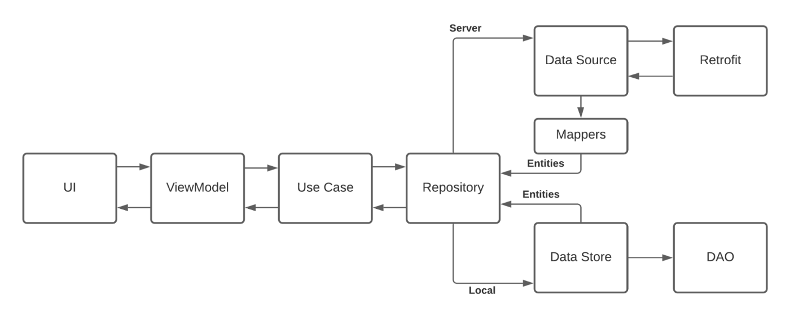
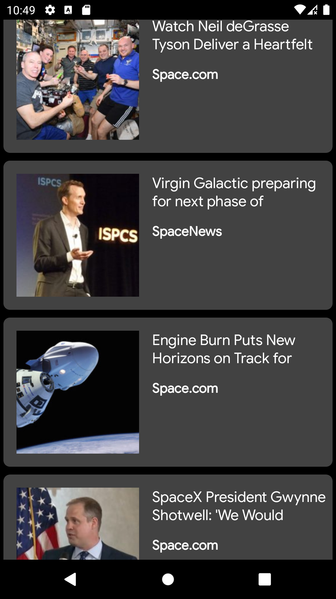
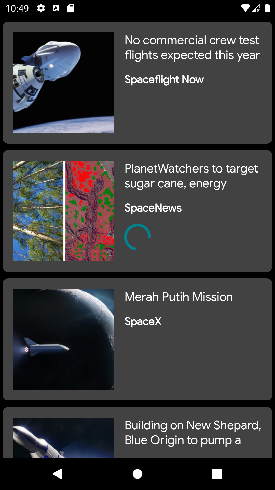
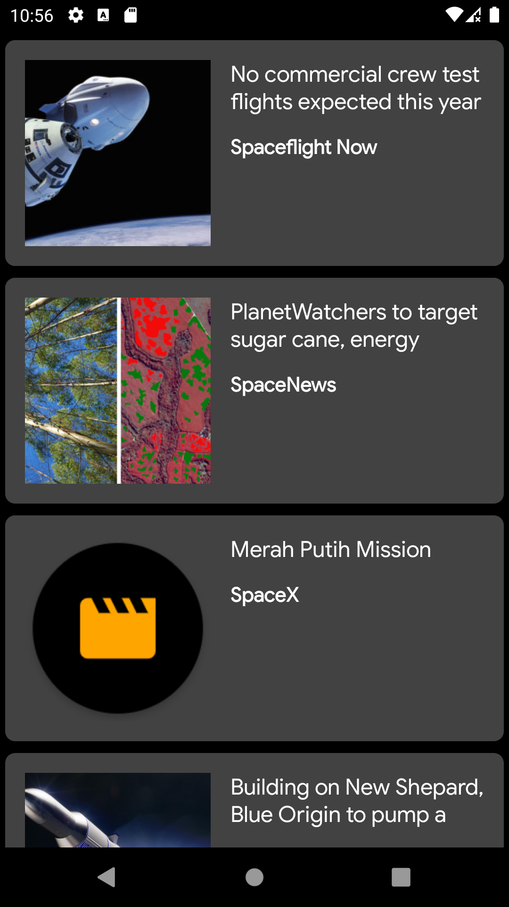
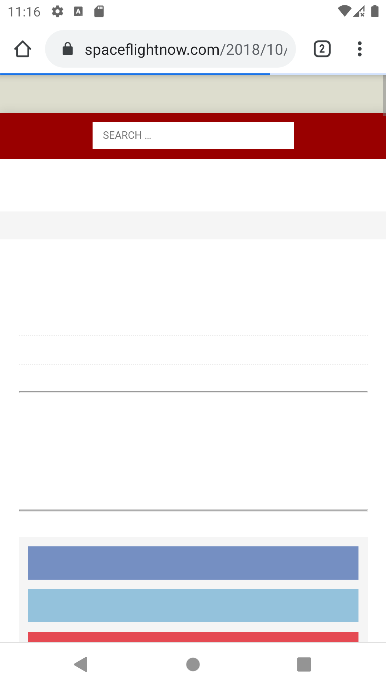
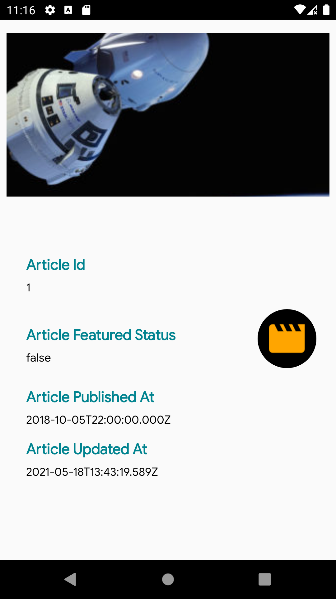

## Read Article Application
Read Articles Android application 📱 built to demonstrate how to use Jetpack Architecture Components in an
Android Application following the Clean MVVM Architecture concepts.

## Application Design Diagram

 

## ⚙ Tech/Libraries used And Features
- Retrieve Network Data from API (REST API)
- Kotlin
- Model-View-Viewmodel Architecture
- Single Activity Application
- JetPackComponents
- Navigation component
- Room database
- Retrofit 2
- Database caching
- GSON
- Monitoring Network Connectivity
- Swipe To Refresh
- Hilt for Dependeny Injection.
- Moshi.
- Unit Tests.
- Android Testing.
- Jacoco Plugin Intergrated for Code Coverage.
- Kotlin Courtines.
- Glide.
- Piccaso.
- View Bindings
- Data-Binding.
- SQL-queries.
- Less Boiler Plate code.
- RecyclerView
- CardView
- LeakCanary
- Timber


##⚙ Testing Libraries
- MockWebServer(Okhttp)
- RoboElectic
- Espersso
- Junit4

## ⚙Integrating the Jacoco plugin.

After enabling JaCoCo in your project, generate your first code coverage in HTML format. 
The following Gradle command will generate a test coverage report for your project:

- .gradlew connectedCheck

This will generate a report for your unit test alone:

- .gradlew testDebugUnitTest

And this will generate the report for an instrumented test:

- .gradlew connectedDebugAndroidTest
You can check the code coverage report of your instrumented and unit tests locally. For your instrumented test, locate your Android studio projects folder in your system. Then navigate to your project folder: _(CodeCoverageExample) > app > build > reports > androidTests > connected > flavors > debugAndroidTest > Index.html.

##⚙Focus is on Testing the application And Status below

- DATABASE TESTING COMPLETED.

- REST API TESTING PENDING.

- ACTIVITY TESTING IS COMPLETED


##⚙ To get started with this project, simply pull the repository and import the project into Android Studio. From there, deploy the project to an emulator or device. 

* NOTE: In order for this project to pull data, you no need to add your API Key and please sure the internet connectivity is good.The Api is used without taking the access token which is permissiable but can access to some limit .Please dont panic if you find some error in between, its the Apis sending us :)
* [Google Developers Console](https://console.developers.google.com/)

## 🚀 Application Workflow
- Get list of Articles on (Screen 1)
- Get details of any specific Article.On clicking on the particluar item in the list.(Screen 2)
- Article details on Web Browser.(Screen 3).Please click on  Icon on Screen2 on the right side.


## Report Issues
Notice any issues with a repository? Please file a github issue in the repository.

## 📷 Screenshots
 





## 🎯 Requirements
- Android 5.0 and Above
- Min sdk version 21

## 💻 Permissions
- Internet


## 📝 License

```
MIT License

Copyright (c) 2020 Dhiraj Dafouti

Permission is hereby granted, free of charge, to any person obtaining a copy
of this software and associated documentation files (the "Software"), to deal
in the Software without restriction, including without limitation the rights
to use, copy, modify, merge, publish, distribute, sublicense, and/or sell
copies of the Software, and to permit persons to whom the Software is
furnished to do so, subject to the following conditions:

The above copyright notice and this permission notice shall be included in all
copies or substantial portions of the Software.

THE SOFTWARE IS PROVIDED "AS IS", WITHOUT WARRANTY OF ANY KIND, EXPRESS OR
IMPLIED, INCLUDING BUT NOT LIMITED TO THE WARRANTIES OF MERCHANTABILITY,
FITNESS FOR A PARTICULAR PURPOSE AND NONINFRINGEMENT. IN NO EVENT SHALL THE
AUTHORS OR COPYRIGHT HOLDERS BE LIABLE FOR ANY CLAIM, DAMAGES OR OTHER
LIABILITY, WHETHER IN AN ACTION OF CONTRACT, TORT OR OTHERWISE, ARISING FROM,
OUT OF OR IN CONNECTION WITH THE SOFTWARE OR THE USE OR OTHER DEALINGS IN THE
SOFTWARE.
```


